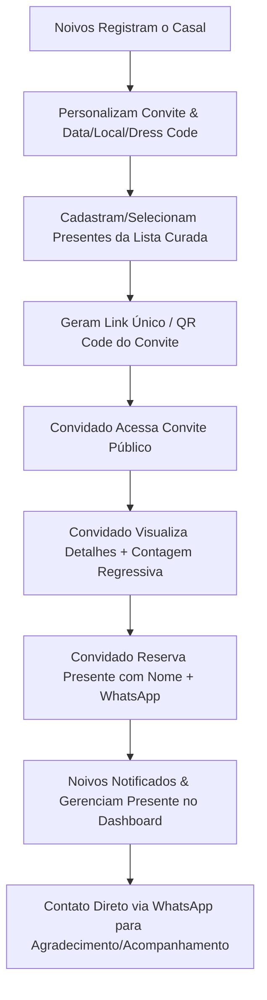

# 💍 Resumo de Negócios e Produto: CasamentoForever

O **CasamentoForever** é uma plataforma **SaaS Multi-Tenant PWA** desenvolvida para simplificar a criação de convites de casamento digitais interativos e a gestão inteligente de listas de presentes. O sistema elimina a burocracia e as altas taxas de intermediação das plataformas tradicionais de casamento, oferecendo uma experiência moderna, leve e bem-humorada tanto para o casal quanto para os convidados.

---

## 🎯 1. Proposta de Valor & Diferenciais (USPs)

- **Experiência Sem Taxas de Intermediação**: Em vez de reter porcentagens abusivas sobre os presentes, a plataforma permite que os noivos recebam contribuições diretamente (Pix) ou direcionem convidados para e-commerces parceiros.
- **Lista de Presentes Divertida & Gamificada**: Além dos itens tradicionais de casa e viagem, a plataforma inclui uma categoria curada de *"Presentes Divertidos"* (ex: *Fundo de Emergência para TPM*, *Taxa para perguntar quando o casal vai ter filhos*, *Curso de dobrar lençol de elástico*). Isso aumenta o engajamento e o envolvimento emocional dos convidados.
- **Reserva Inteligente Anti-Duplicidade**: O convidado reserva o item em 2 cliques (Nome + WhatsApp) sem necessidade de cadastro complexo, marcando o item como indisponível e evitando presentes repetidos.
- **Mobile-First & PWA**: Design nativo para smartphones, com navegação fluida via barra inferior (`BottomNav`), respostas rápidas e integração ao WhatsApp.
- **Growth Loop Viral (Product-Led Growth)**: Cada convite público exibido contém o selo *"Vai casar também?"*, convertendo convidados de casamentos atuais em novos noivos clientes da plataforma.

---

## 👥 2. Público-Alvo e Personas

1. **Os Noivos (Clientes)**:
   - Casais jovens e conectados que buscam praticidade, controle em tempo real dos presentes recebidos e um convite elegante com mapa, regras de vestuário e contagem regressiva.
   - Querem economizar na lista de presentes sem perder o charme da celebração.

2. **Os Convidados (Usuários Finais)**:
   - Amigos e familiares de todas as idades que demandam extrema facilidade para visualizar o local da festa, confirmar informações e reservar/comprar presentes sem burocracia.

---

## 🔄 3. Jornada do Usuário (User Journey)

---

## 📦 4. Módulos e Funcionalidades do Produto

### A. Painel do Casal (`Dashboard` & `EventForm`)
- **Gestão do Evento**: Cadastro do local (com link para Google Maps), data/horário com contador regressivo em tempo real, Dress Code e contatos de apoio.
- **Gerenciador de Presentes**: Criação, edição e exclusão de presentes personalizados (foto, descrição, valor e links de lojas externas).
- **Central de Presentes Reservados (`ReceivedGifts`)**:
  - Tabela explicativa de quem reservou cada item (com nome, WhatsApp e data).
  - Botão com **integração imediata ao WhatsApp** para conversar diretamente com o convidado.
  - Controle de status (*Reservado* vs *Recebido*) e opção de desvincular reserva caso haja desistência.
- **Gerador de Convite & QR Code**: Link exclusivo (`/#/convite/:qrToken`) para compartilhamento rápido em redes sociais e impressos.

### B. Portal Público do Convidado (`PublicEventDetail`)
- **Convite Interativo**: Layout sofisticado com contagem regressiva para a cerimônia, informações sobre trajes, endereço com abertura direta no Google Maps e contato para dúvidas.
- **Catálogo de Presentes**:
  - Filtros por categorias (*Cozinha*, *Quarto*, *Lua de Mel*, *Sobrevivência*, *Lista Divertida*).
  - Status em tempo real dos presentes (*Disponível* vs *Já Reservado*).
- **Modal de Reserva Rápida**: Coleta simplificada de nome e telefone. Ao confirmar, o presente exibe as instruções diretas de compra ou chave Pix definidas pelos noivos.

---

## 🛠️ 5. Resumo da Arquitetura Técnica

- **Frontend**: React + Vite + Tailwind CSS (Interface reativa, responsiva e performática).
- **Backend**: Node.js com Express e arquitetura Multi-Tenant isolada por `tenant_slug`.
- **Banco de Dados**: LibSQL / Turso (SQLite remoto/local com suporte a migrações dinâmicas e log de auditoria `audit_logs`).
- **Segurança**: Autenticação JWT com isolamento cross-tenant e senhas encriptadas com SHA-256.

---

## 💡 Resumo de Valor para o Negócio
O **CasamentoForever** se posiciona no mercado de eventos digitais como uma solução de **alta retenção e baixo custo operacional**. Sua abordagem focada na simplicidade de uso, engajamento por humor e loops de indicação orgânica torna a plataforma um ativo escalável e com forte apelo visual e comercial.

